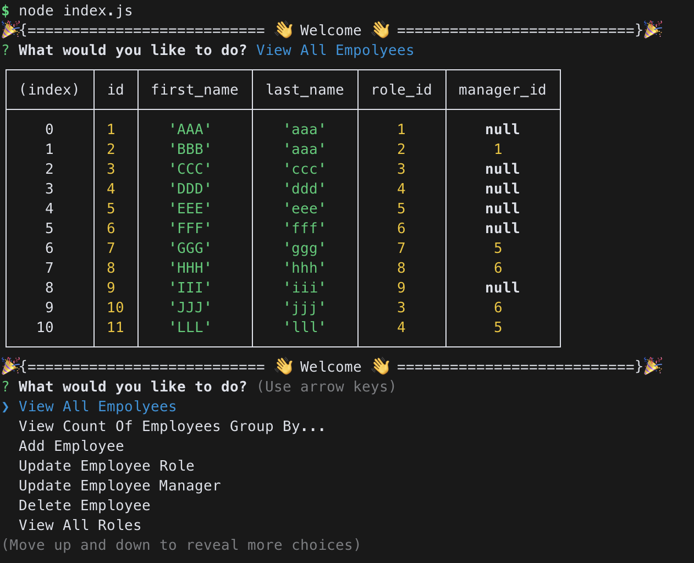
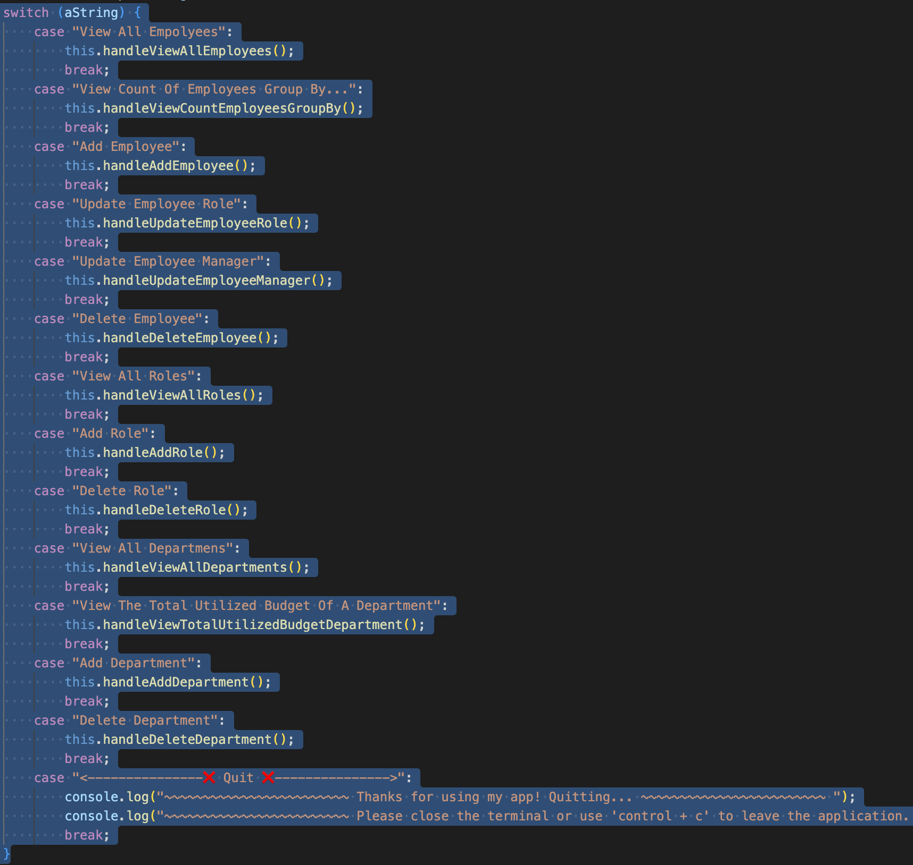
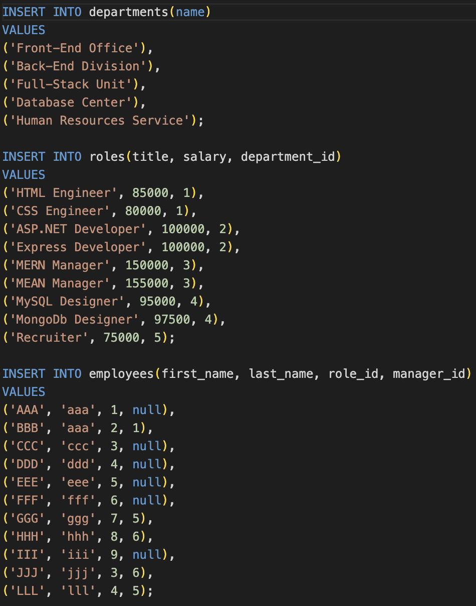
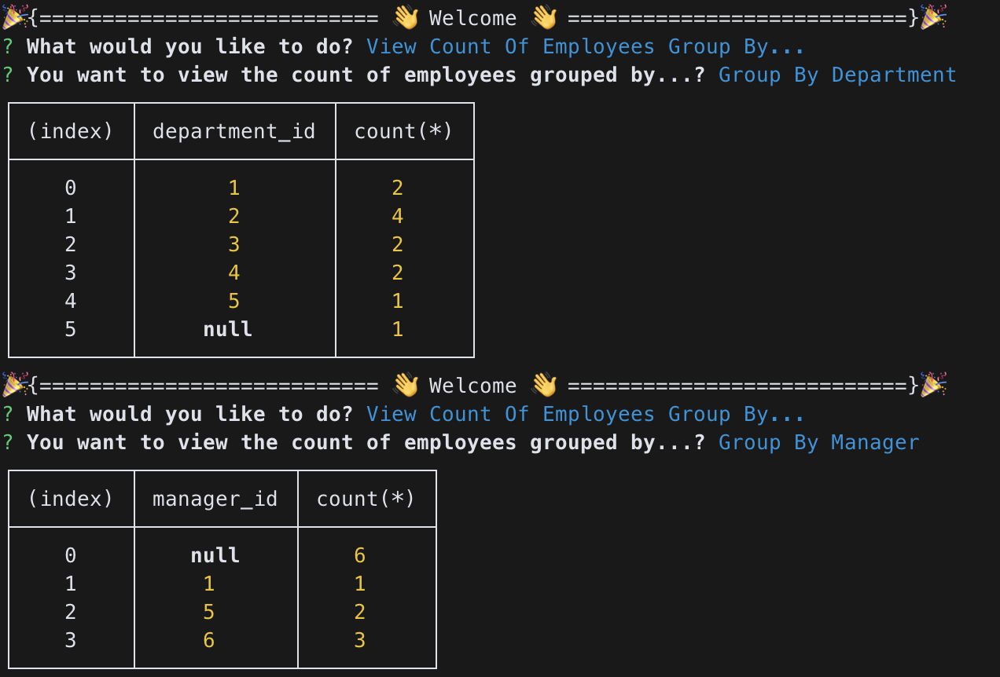
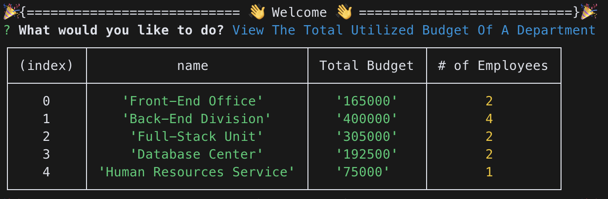
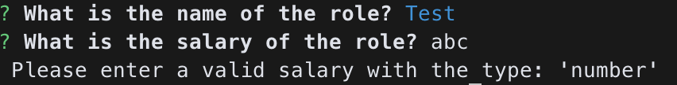

# Andrew's Employee Tracker

## 🔎 Overview:
> * Connecting to MySql database using "mysql2"
>
> * Hiding database configuration information (DB_NAME, DB_USER, and DB_PASSWORD) by utilizing "dotenv"
>
> * Prompting questions and collecting data with "inquirer"
>
> * To install dependencies, run "npm i" and then start the application with "node index"
>
> * Accessing the db folder, use the command "mysql -u root -p" to enter the MySQL terminal. After entering your password, execute the commands "source schema.sql" and "source seeds.sql" to set up the database and tables.
>
> **Note**: Don't forget to rename '.env.Example' to '.env' and update the default settings with your own
>


## 🎬 Link Of The Video:
❗❗❗ ☛ [Clik Me To The Page!](https://drive.google.com/file/d/1lEcN_XXVjbq3NGa0naqvl_skkCkAHCm8/view) ☚ ❗❗❗

```
Video's URL: 
https://drive.google.com/file/d/1lEcN_XXVjbq3NGa0naqvl_skkCkAHCm8/view

(If the link is not functional, please refer to the gif demonstration at the bottom of the document for guidance.)
```

## 📷 Screenshots Of The Applications:

||
|:--:| 
| *↑ Overview of the console app ↑* |

||
|:--:| 
| *↑ A CRUD (Create, Read, Update, Delete) Application for managing three separate tables. ↑* |

||
|:--:| 
| *↑ Tables Schema ↑* |

||
|:--:| 
| *↑ Seeds Data ↑* |

||
|:--:| 
| *↑ Sample Of The Group By... ↑* |

||
|:--:| 
| *↑ Sample Of The Department's Total Budget ↑* |

||
|:--:| 
| *↑ The application includes various validation checks. ↑* |

||
|:--:| 
| *↑ Short Demo ↑* |
- - -
© 2023 edX Boot Camps LLC. Confidential and Proprietary. All Rights Reserved.
